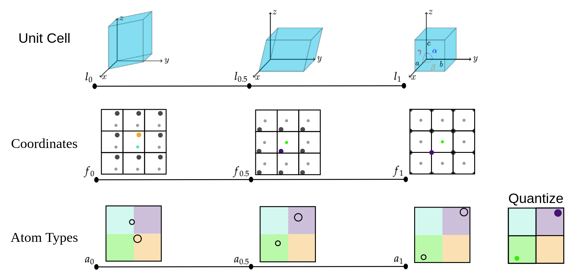

# FlowMM: Generating Materials with Riemannian Flow Matching

<div align="center">

[](https://arxiv.org/abs/2406.04713)
[](https://twitter.com/bkmi13/status/1803038219790942565)

</div>

### Crystal Structure Prediction

<p align="center">

</p>

### De Novo Generation

<p align="center">

</p>

# Installation

Follow the steps to get the files:

```bash
# clone this repo into the folder flowmm/
cd flowmm
git submodule init
git submodule update
bash create_env_file.sh  # creates the necessary .env file
```

The submodules include [CDVAE](https://arxiv.org/abs/2110.06197), [DiffCSP](https://arxiv.org/abs/2309.04475), and [Riemannian Flow Matching](https://arxiv.org/abs/2302.03660).

Now we can install `flowmm`. We recommend using `micromamba` because conda is extremely slow. You can install `micromamba` by [following their guide](https://mamba.readthedocs.io/en/latest/installation/micromamba-installation.html#automatic-install). If the installation fails, try again a few more times.

```bash
micromamba env create -f environment.yml
```

Activate using

```bash
micromamba activate flowmm
```


# Data

The training data is in `.csv` format in `data/`. When you first train on it, the script will convert the data into a faster-to-load format.

If you want to compute energy above hull, you must [download the convex hull from 2023-02-07](https://figshare.com/articles/dataset/Matbench_Discovery_v1_0_0/22715158?file=40344451). Extract the files to the folder `mp_02072023/`. We got this hull from [Matbench Discovery](https://matbench-discovery.materialsproject.org/).


# Experiments

The various datasets you can train on are as follows:
```
data \in {perov, carbon, mp_20, mpts_52}
```

There are a few preselected `model` options in `scripts_model/conf/model`. The format is `{atom_type_manifold}_{lattice_manifold}`.

Atom type manifolds:
- `abits` - [analog bits](https://arxiv.org/abs/2208.04202) proposed for use in FlowMM
- `null` - used for conditional generation
- `simplex` - the method used to fit the atom types in DiffCSP

Lattice manifolds:
- `nonsym` - the method to fit the lattice in DiffCSP
- `params` - our proposed method in FlowMM, lattice parameters
- `params_normal_base` - ablated version where the lattice parameters base distribution is gaussian and not sent to constrained space.

### Conditional Training

```bash
python scripts_model/run.py data=perov model=null_params
```

### Unconditional Training

```bash
python scripts_model/run.py data=perov model=abits_params
```

## Evaluation

Discussion about evaluation is limited to FlowMM. `scripts_model/evaluate.py` uses `click`, allowing it to serve as a multi-purpose evaluation program.

### Conditional Evaluation - Crystal Structure Prediction - Reconstruction

These commands will:  
1. reconstruct the `test` set
2. consolidate the results into a single torch pickle with the correct format
3. compute the match rate and root mean square error, compared to the `test` set
4. create plots of the distribution of lattice parameters, compared to the `test` set

The user must provide `PATH_TO_CHECKPOINT`, `NAME_OF_SUBDIRECTORY_AT_CHECKPOINT`, `SLOPE_OF_INFERENCE_ANTI_ANNEALING`.

```bash
ckpt=PATH_TO_CHECKPOINT
subdir=NAME_OF_SUBDIRECTORY_AT_CHECKPOINT
slope=SLOPE_OF_INFERENCE_ANTI_ANNEALING
python scripts_model/evaluate.py reconstruct ${ckpt} --subdir ${subdir} --inference_anneal_slope ${slope} --stage test && \
python scripts_model/evaluate.py consolidate ${ckpt} --subdir ${subdir} && \
python scripts_model/evaluate.py old_eval_metrics ${ckpt} --subdir ${subdir} --stage test && \
python scripts_model/evaluate.py lattice_metrics ${ckpt} --subdir ${subdir} --stage test
```

### Unconditional Evaluation - De Novo Generation

These commands will:
1. generate 10k structures from a checkpoint
2. consolidate the results into a single torch pickle with the correct format
3. compute the De Novo Generation proxy metrics, compared to the `test` set
4. create plots of the distribution of lattice parameters, compared to the `test` set

The user must provide `PATH_TO_CHECKPOINT`, `NAME_OF_SUBDIRECTORY_AT_CHECKPOINT`, `SLOPE_OF_INFERENCE_ANTI_ANNEALING`.

```bash
ckpt=PATH_TO_CHECKPOINT
subdir=NAME_OF_SUBDIRECTORY_AT_CHECKPOINT
slope=SLOPE_OF_INFERENCE_ANTI_ANNEALING
python scripts_model/evaluate.py generate ${ckpt} --subdir ${subdir} --inference_anneal_slope ${slope} && \
python scripts_model/evaluate.py consolidate ${ckpt} --subdir ${subdir} && \
python scripts_model/evaluate.py old_eval_metrics ${ckpt} --subdir ${subdir} --stage test && \
python scripts_model/evaluate.py lattice_metrics ${ckpt} --subdir ${subdir} --stage test
```

#### Prerelaxation

Taking the generations from the previous step, we can prerelax them using [CHGNet](https://chgnet.lbl.gov/) on the cpu. This script works locally, but it is designed to parallelize the process over nodes on a slurm cluster.

If you want to use slurm, the user must then provide `YOUR_SLURM_PARTITION`.

```bash
# get the path to the structures 
eval_for_dft_pt=$(python scripts_model/evaluate.py consolidate "${ckpt}" --subdir "${subdir}" --path_eval_pt eval_for_dft.pt | tail -n 1)

# get the eval_for_dft_json
parent=${eval_for_dft_pt%/*}  # retain part before the last slash
eval_for_dft_json="${eval_for_dft_pt%.*}.json"  # retain part before the period, add .json
log_dir="${parent}/chgnet_log_dir"

# set other flags, if you are using slurm.
num_jobs=1
slurm_partition=YOUR_SLURM_PARTITION

# prerelax
python scripts_analysis/prerelax.py "$eval_for_dft_pt" "$eval_for_dft_json" "$log_dir" --num_jobs "$num_jobs" --slurm_partition "$slurm_partition"
```

#### Preparing Density Functional Theory

We can continue by doing density functional theory (DFT) with [VASP](https://www.vasp.at/).

The user must provide `PATH_TO_YOUR_PSEUDOPOTENTIALS`, which requires a VASP license.

```bash
export PMG_VASP_PSP_DIR=PATH_TO_YOUR_PSEUDOPOTENTIALS 

# create the folder to hold the dft files
dft_folder="${parent}/dft"
mkdir -p "$dft_folder"

# create the dft inputs
python scripts_analysis/dft_create_inputs.py "${eval_for_dft_json}" "${dft_folder}"
```

We do not provide guidance on running DFT.

We note that your DFT results should typically be [corrected using the settings from the Materials Project](https://docs.materialsproject.org/methodology/materials-methodology/thermodynamic-stability/thermodynamic-stability).


#### Computing Energy Above Hull

We can compute the energy above hull using the (corrected) DFT relaxed energies or the CHGNet prerelaxed energies.

Note: This whole section requires downloading the convex hull from above!

If you want to use the CHGNet prerelaxed energies you can use the following commands. Since the prerelaxed energies are generally inaccurate, they go in their own column in the `.json` file. The prerelaxed energy above hull from CHGNet will be computed whether or not DFT relaxations were run.

```bash
json_e_above_hull="${parent}/ehulls.json"
python scripts_analysis/ehull.py "${eval_for_dft_json}" "${json_e_above_hull}"
```

If you want to use your DFT calculations you can use the following code. Our script expects that `clean_outputs` contains trajectory files with name `######.traj` where `######` corresponds to the index of the corresponding row in the `${eval_for_dft_json}` file.

```bash
clean_outputs_dir="${parent}/clean_outputs"
json_e_above_hull="${parent}/ehulls.json"
python scripts_analysis/ehull.py "${eval_for_dft_json}" "${json_e_above_hull}" --clean_outputs_dir "${clean_outputs_dir}"
```

##### Computing the Corrected Energy Above Hull

We have a script which does the corrections for you, but it must correspond to our format. There must be a root directory that has (1) a subdirectory called `dft`, which was created using `scripts_analysis/dft_create_inputs.py` and (2) a subdirectory called `clean_outputs`, which contains trajectory files with name `######.traj` where `######` corresponds to the index of the corresponding row in the `${eval_for_dft_json}` file.

```bash
root_dft_clean_outputs="${parent}"
ehulls_corrected_json="${parent}/ehulls_corrected.json"
python scripts_analysis/ehull_correction.py "${eval_for_dft_json}" "${ehulls_corrected_json}" --root_dft_clean_outputs "${root_dft_clean_outputs}"
```

#### Computing S.U.N.

The most accurate estimates of S.U.N. structures occur when using corrected DFT relaxed energies.

```bash
sun_json=sun.json
python scripts_analysis/novelty.py "${eval_for_dft_json}" "${sun_json}" --ehulls "${ehulls_corrected_json}"
```

# FlowLLM Model

The FlowLLM model combines RFM and [CrystalLLM](https://arxiv.org/abs/2402.04379) by using the LLM as a learned base distribution for the RFM model.

To train the FlowLLM from scratch, you need to train the CrystalLLM model first: Get the CrystalLLM codebase from [https://github.com/facebookresearch/crystal-text-llm](https://github.com/facebookresearch/crystal-text-llm). Follow the instructions in that repo to fine-tune a LLaMA model on the MP-20 dataset. After training, generate a large number of samples from that model and create a dataset to train the RFM model. 
For convenience, a subset of the data used in the FlowLLM paper is available in: `data/mp20_llama/`.

Once this training data has been created, the FlowLLM model can be trained just like FlowMM with Conditional Training. Be sure to set `base_distribution_from_data=True` to read the initial samples from the dataset file.

```bash
python scripts_model/run.py data=mp20_llama model=null_params base_distribution_from_data=True
```


# Citation

If you find this repository helpful for your publications, please consider citing our papers:

```
@inproceedings{
    miller2024flowmm,
    title={Flow{MM}: Generating Materials with Riemannian Flow Matching},
    author={Benjamin Kurt Miller and Ricky T. Q. Chen and Anuroop Sriram and Brandon M Wood},
    booktitle={Forty-first International Conference on Machine Learning},
    year={2024},
    url={https://openreview.net/forum?id=W4pB7VbzZI}
}

@inproceedings{
    sriram2024flowllm,
    title={FlowLLM: Flow Matching for Material Generation with Large Language Models as Base Distributions},
    author={Anuroop Sriram and Benjamin Kurt Miller and Ricky T. Q. Chen and Brandon M. Wood},
    booktitle={NeurIPS 2024},
    year={2024},
    url={}
}
```

# License

`flowmm` is CC-BY-NC licensed, as found in the `LICENSE.md` file. However, the git submodules may have different license terms:
- `cdvae`: MIT License
- `DiffCSP-official`: MIT License
- `riemmanian-fm`: [CC BY-NC 4.0 License](https://creativecommons.org/licenses/by-nc/4.0/)

The licenses for the dependencies can be viewed at the corresponding project's homepage.
